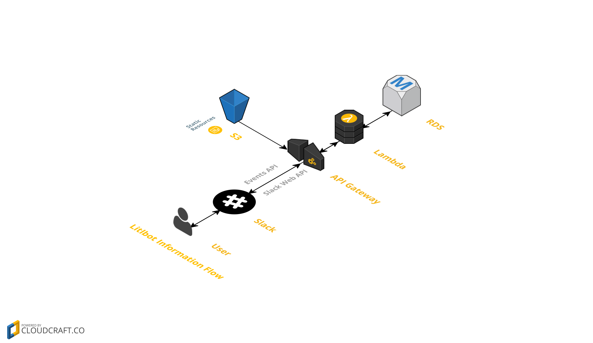

#Litlbot

Next generation ‘in classroom’ experience. Litlbot is a Slack bot that enables realtime interaction with students in class, for a more personalized learning.

##Digital Assistant for Professors
Litlbot allows professors to take a live 'in classroom' pop quiz or take a feedback survey from students. Questions could be based on course content, teaching speed, class notes, assignments, quizzes etc.

##Assess Feedback
Professors can view feedback results in a live classroom and adapt in real time.

##Students ask anonymous questions
Not every student is comfortable asking questions in a classroom. Litlbot allows students to anonymously ask questions.

## Deployment Instructions
[Click here](./Deployment.md)

## Testing instructions
1. Visit the [homepage]() to add the bot to your team.
2. Bot assumes that the user adding this bot is the professor and all other team members are students.
3. Say `hi` to the bot and it will guide you about the functionality.

## Dev Stack
1. Python, Django
2. [Zappa](https://github.com/Miserlou/Zappa) - a serverless Python webservices framework
3. Slack [Events API](https://api.slack.com/events-api)

This is a Django web app. The project uses Zappa to deploy the app on AWS Lambda + API Gateway. The bot uses Slack Events API. The events are received on an API Gateway url and sent to Lambda for processing.
## AWS Services Used
1. API Gateway
2. Lambda
3. SNS
4. RDS
5. S3

##Architecture

